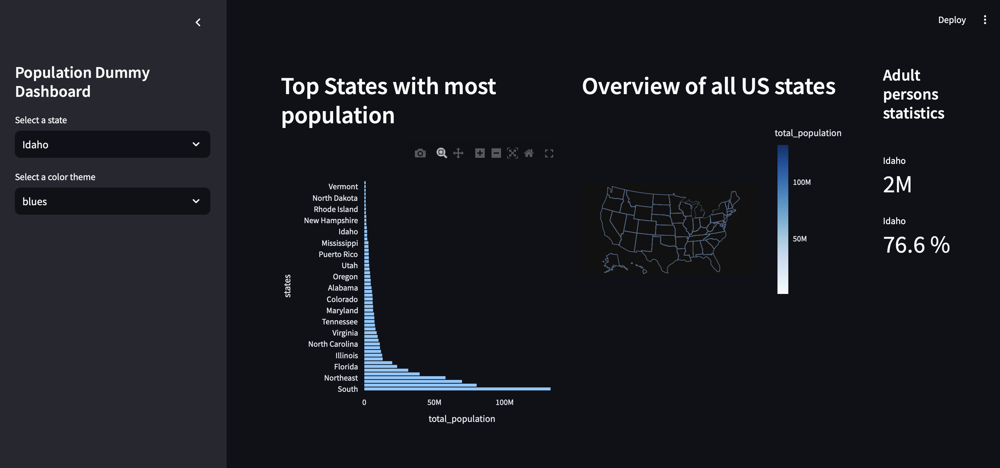

## Interactive Dashboard using plotly and streamlit

Simple python dashboard project with no CSS skills, just only pure simple python.

### Features:
- **Data Visualization**: Utilizes Plotly for interactive charts.
- **State Selection**: Allows users to select states from a dropdown menu.
- **Color Theme Selection**: Users can choose different color themes for the visualizations.
- **Responsive Layout**: Uses Streamlit's layout capabilities to create a responsive dashboard.

### Technologies Used:
- **Streamlit**: For creating interactive web applications in Python.
- **Plotly**: For data visualization and plotting.
- **Polars**: As an alternative to pandas for faster data manipulation.

### Getting Started:
1. Clone the repository.
2. Install the required packages using `uv sync`
3. Run the application using Streamlit by running `streamlit run src/app.py` from the project directory.

